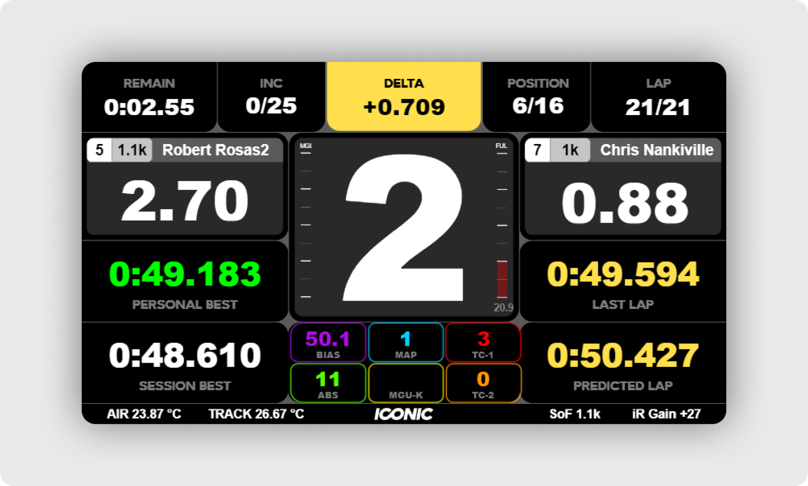

 
 

    
    

 

    <strong>A race-first SimHub dash.</strong> <a href="#introduction">Read more</a>.

 

    

 

# Introduction
ICONIC Dash is a SimHub racing dashboard built with a race-first philosophy. This means every decision regarding what to show, where to show it, or with what size, was taken prioritizing what a driver will need most on the hit of a race. 

As an example of this philosophy, common information in other dashboards was deliberately excluded, like speed, rpm, or throttle and brake inputs. Even some design elements like icons or logos were also excluded from the prime space to allow easy readability of important things during a race, like deltas, lap times, or race progress.

This is only version one. There are several unique features on the roadmap ahead. [Join our Discord community server](https://discord.gg/3WU9YCKqF4) to stay updated with the latest releases and share your feedback and ideas.

# Getting Started
## Download and Install

1. Download & Install [**SimHub Dash**](https://www.simhubdash.com) app
2. Download & Install [**Tango Sans Font**](https://www.dafont.com/tangosans.font)
3. Download & Install the [**ICONIC Dash Latest Release**](https://github.com/iconic-simracing/iconic-dash/releases)
4. Setup your [**SimHub Action Triggers**](./docs/actions.md) to control the ICONIC Dash UI

## Compatible Sims
ICONIC Dash offers native support for many sims, but will work with any simulator that offers native data to SimHub like:

* [Assetto Corsa Competizione](https://assettocorsa.gg/assetto-corsa-competizione/)
* [Assetto Corsa](https://assettocorsa.gg/assetto-corsa/)
* [iRacing](https://www.iracing.com)
* [Automobilista 2](https://www.game-automobilista2.com)
* [rFactor 2](https://www.studio-397.com/rfactor2/)
* [Formula 1](https://www.ea.com/en-gb/games/f1/)

## Disclaimer

All trademarks, logos and brand names are the property of their respective owners. All company, product and service names used in this application are for identification purposes only. Use of these names, trademarks and brands does not imply endorsement unless otherwise stated.

 

This work is licensed under [Creative Commons Attribution-NonCommercial-ShareAlike 4.0 International](http://creativecommons.org/licenses/by-nc-sa/4.0/)

> [!NOTE]
> Although the ICONIC Dash is distributed for free, usage of its user interface design (UI) is also subject to the license it is distributed under. Any use in commercial or marketing material, promotional still or animated images and videos is forbidden unless direct consent is given.
